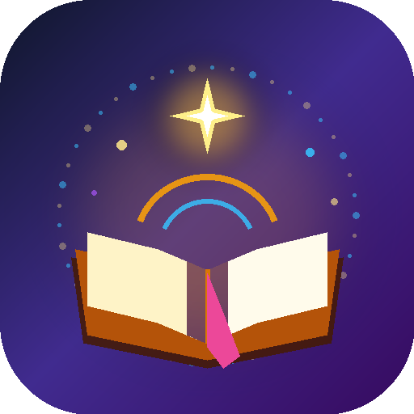

# 📖 Crew Story (繪本說書人 · AI 繪本創作與即時語音說書)

<p align="center">
  
</p>

<p align="center">
  <strong>Next-Generation Multimodal Picture Book Creator & Real-time Interactive AI Storyteller</strong><br>
  次世代多模態繪本創作 · 專屬跨頁故事編輯器 · Gemini 3.1 Live 雙向即時說書 · 官方 30 款聲線試聽 · 語音精準同步翻頁 · 經典白雪公主預設繪本
</p>

<p align="center">
  <a href="LICENSE"></a>
  <a href="#"></a>
  <a href="#"></a>
  <a href="#"></a>
  <a href="#"></a>
</p>

---

## 🌟 核心特色 (Key Highlights)

- 🎙️ **Gemini 官方 30 款預建聲線全支援（Official Live Voices）**：精確對齊 Google Gemini Live 官方 30 款音色（女性 15 位：Kore, Aoede, Leda, Callirrhoe, Autonoe, Despina, Erinome, Laomedeia, Achernar, Vindemiatrix, Sadachbia, Sulafat, Algieba, Pulcherrima, Achird；男性 15 位：Puck, Charon, Fenrir, Orus, Zephyr, Enceladus, Iapetus, Umbriel, Algenib, Rasalgethi, Alnilam, Schedar, Gacrux, Zubenelgenubi, Sadaltager），包含即時試聽與安全防呆回退。
- ✏️ **專屬繪本故事編輯器（Story Editor）**：支援隨時修改書名、封面 Emoji、大綱，以及跨頁增刪、上下排序、旁白潤飾、角色情緒設定與每頁本地插圖更換/移除。
- 🎧 **純淨沉浸式播放介面（Clean Story Player）**：播放器專注於聲情並茂的繪本朗讀體驗，移除誤觸的上傳按鈕，有圖展示全幅插畫，無圖展現優雅書卷佈景，右上角可一鍵跳轉編輯器。
- 🍎 **預設經典故事《白雪公主與七個小矮人》**：內建 6 個起承轉合章節、生動角色情緒對白（壞王后、白雪公主、小矮人、王子），打開立即沉浸聽故事。
- 🔄 **精準音訊同步翻頁（Audio-Synchronized Page Advance）**：完整確保每頁音訊全部播放完畢後才自動翻頁與發送 Tool Response，絕不搶先跳頁。
- 📱 **精美底部導航欄（Crew Pocket Bottom Nav）**：膠囊狀高亮 Active 狀態指示與沉浸式暗色設計語彙。
- 🌐 **中英雙語操作介面（Bilingual UI）**：頂部 AppBar 與設定一鍵切換繁體中文 / English。
- 🌍 **首頁多語言說書人（Multilingual Storyteller）**：支援繁體中文、English、日本語、한국어、Français、Deutsch、Español 快速切換。
- 🪄 **AI 提示詞魔法優化（Gemini Visual Prompt Enhancer）**：由 Gemini 結合情境旁白、角色與情緒，一鍵擴充生成大師級高細節英文生圖 Prompt。
- 📱 **Google Play Release Kit**：內建完整繁中/英文商店資訊、隱私權政策與審核指引 (`google-play-release/`)。
- 🔒 **隱私安全 (BYOK)**：支援自備 Gemini API Key，本機加密儲存，自動相容讀取共用設定。

---

## 🏗️ 核心架構與重要程式碼 (Architecture)

```
app/src/main/
├── java/com/crewpocket/story/
│   ├── MainActivity.java               # 故事書架、語言切換、多語言講者、聲線快捷切換、創作對話框
│   ├── StoryEditorActivity.java        # 獨立繪本編輯工作台 (跨頁章節、配圖、AI 提示詞優化、文字、排序增刪)
│   ├── VoicePersonaDialog.java         # 官方 30 款 Gemini Live 聲線選擇器與即時試聽模組 (15 女聲 + 15 男聲)
│   ├── StoryPlayerActivity.java        # 繪本閱讀器 UI、進度控制、插圖展示與對話高亮
│   ├── StoryPlaybackService.java       # 前台背景媒體服務 (關螢幕持續說書、Media Notification)
│   ├── StoryLiveClient.java            # Gemini 3.1 Live WebSocket 狀態機、音訊播放佇列與精準翻頁同步
│   ├── StoryIllustrationGenerator.java # 繪本插圖生成引擎 (Imagen 3 / SDXL Turbo / Gemini Prompt Enhancer)
│   ├── I18n.java                       # 中英雙語國際化輔助類別
│   ├── StoryGenerator.java             # OkHttpClient 多模型備援故事生成 (gemini-3.6/3.5/2.5-flash)
│   ├── StoryModel.java                 # 繪本資料結構模型 (章節、對白、情緒、插圖 URI)
│   ├── StoryRepository.java            # 本地書庫持久化管理 (預設白雪公主繪本)
│   ├── AppConfig.java                  # BYOK 金鑰、30 款官方聲線、語言、UI 配置
│   ├── CrewTheme.java                  # 深色設計語彙、自適應圓角與色彩規範
│   └── NativeOboeOutput.java           # JNI C++ Oboe 原生音訊播放介面
└── cpp/
    └── CrewOboeOutput.cpp              # 低延遲 Oboe 24kHz PCM 播放引擎
```

---

## 🚀 快速開始 (Getting Started)

### 1. 安裝 App
可直接從手機下載資料夾安裝最新打包簽署之 APK：
- 📦 `/sdcard/Download/CrewStory-v1.0.26.apk` (或 `/sdcard/Download/CrewStory.apk`)

### 2. 設定 Gemini API Key (BYOK)
1. 前往 [Google AI Studio](https://aistudio.google.com/apikey) 獲取免費 API Key。
2. 開啟 **Crew Story** ➡️ 點擊右下角 **「⚙️ 偏好設定」**。
3. 貼上 API Key 並點選 **「儲存 API Key」**。

### 3. 開始聽故事 / 編輯 / 創作新繪本
- 點選書架上的《白雪公主與七個小矮人》卡片或「▶️ 播放」按鈕，立即聽書！
- 點選卡片下方的「✏️ 編輯」按鈕，即可進入編輯器隨心調整每一頁的插圖、文字與對白，並可用「🪄 AI 魔法優化」配圖。
- 點擊 **「✨ 創作故事」**，輸入主題或上傳照片，自動生成全新繪本。

---

## 📱 Google Play 上架資料包 (Store Release Kit)
完整上架文案、各國語言描述與隱私權政策已收錄於：
- 📄 [Google Play 商店資訊 (GOOGLE_PLAY_STORE_LISTING.md)](google-play-release/GOOGLE_PLAY_STORE_LISTING.md)
- 🔒 [隱私權政策 (PRIVACY_POLICY.md)](google-play-release/PRIVACY_POLICY.md)

---

## 🛠️ 一鍵編譯與打包 (Build from Source)

```bash
cd /data/data/com.termux/files/home/crew-story
./build.sh
```

---

## 📄 License
MIT License. Open source and privacy-first.
